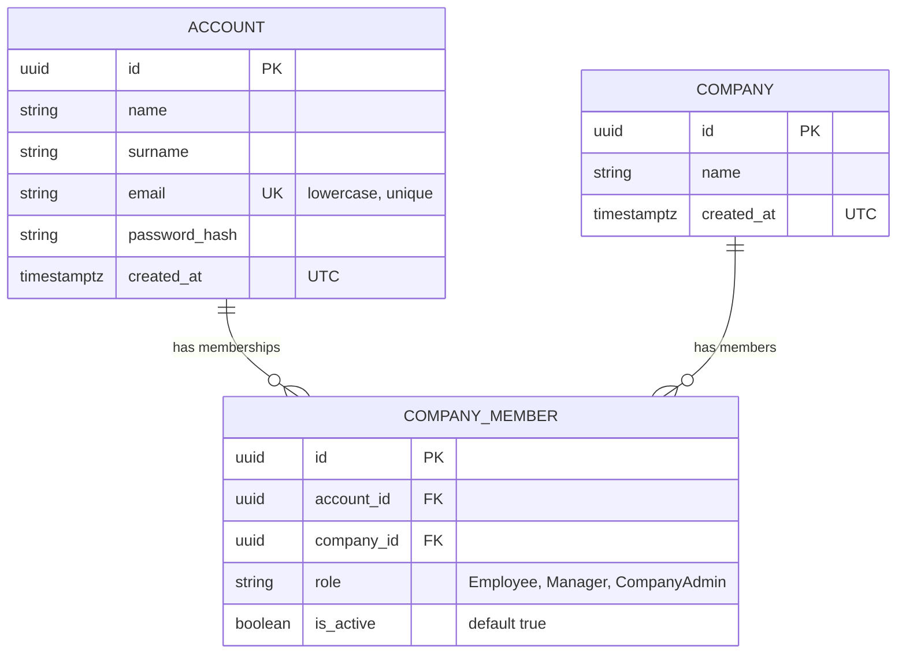

# Identity

```mermaid
erDiagram
  ACCOUNT {
    uuid id PK
    string name
    string surname
    string email UK "lowercase, unique"
    string password_hash
    timestamptz created_at "UTC"
  }

  COMPANY {
    uuid id PK
    string name
    timestamptz created_at "UTC"

  }

  COMPANY_MEMBER {
    uuid id PK
    uuid account_id FK
    uuid company_id FK
    string role "Employee, Manager, CompanyAdmin"
    boolean is_active "default true"
  }

  ACCOUNT ||--o{ COMPANY_MEMBER : "has memberships"
  COMPANY ||--o{ COMPANY_MEMBER : "has members"
```
